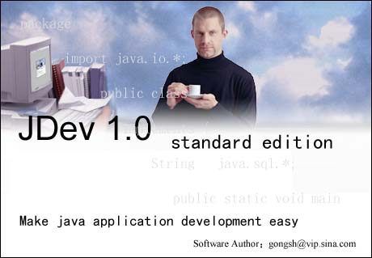

	                Visual JDev 1.0 产品说明
	                
    Visual JDev 1.0是一款专业的java IDE，融开发、调试、运行于一体。其强大而方便的
集成开发调试功能，让你可以快速开发出自己的java应用。IDE采用win32而非java Swing开发，
所以运行性能极好，对内存要求也很小。其中的部分功能甚至超过高端的Java IDE产品。
    在开发java application应用方面，丝毫不逊色于JBuilder和Visualage for java等高端
的java IDE产品。

JDev IDE was developped by me from 2002 to 2004. It is a shareware software.
1. Download JDev.zip and unzip it to d:\
2. Run D:\JDev\bin\JDev.exe
3. File->Recent Open Project->D:\JDev\Project\FirstProject\FirstProject.jdp
4. Double click [Test.java], press F9 to debug

下面是Visual JDev 1.0 的主要功能列表：

IDE 部分
1、支持开发java application、applet的开发调试；
2、以工程的方式组织java应用，支持包组织功能；
3、支持java、xml、html、jsp等各种文件的语法高亮显示；
4、新建文件向导，包括普通java文件，java接口，jsp，applet，servlet；
5、支持类浏览，通过向导可以自动添加类方法和属性；
6、支持类编译、运行，可以模拟控制台输入输出；
7、支持版本化工程以及导入工程；
8、可以将工程生成jar文件；
9、提供反编译工具；
10、保存文件时自动检测语法错误，快速定位错误所在位置；
11、众多的内部java检测机制，引导用户进行正确操作；
12、支持对象方法和属性自动显示；
13、支持代码缩进以及自动格式化等；
14、支持代码自动完成；
15、支持编译java程序，可以快速定位错误所在位置；
16、支持通用的编辑功能，如剪切、拷贝、粘贴等；
17、支持书签功能；
18、编辑区支持多种选择方式，common select,row select，Column select，支持类方法的快速选择；
19、支持查找、查找替换、工程内查找等功能；
20、支持打印，打印预览；
21、开发环境的个性化，用户可以随意配置IDE的众多参数，包括各种配色方案；
22、优秀的JDK帮助向导，可以快速查找类的属性方法，并快速定位到JDK函数对应的DOC位置

DEBUG 部分
1、支持多个java程序同时调试的功能；
2、支持单步运行，单步进入函数，单步跳出函数等调试方式；
3、支持行断点、函数断点以及异常断点调试；
4、支持线程suspend以及resume功能；
5、支持控制台模拟功能；
6、支持变量监视功能；
7、以树的方式显示当前帧所有可视的变量，可以快速跟踪变量和变量的子变量；
8、自动监测源文件是否改动；
9、操作简单方便，快捷键定义与delphi给JBuilder类似

## Demo
- Video: [jdev-video.mp4](./jdev-video.mp4)
- Image:

